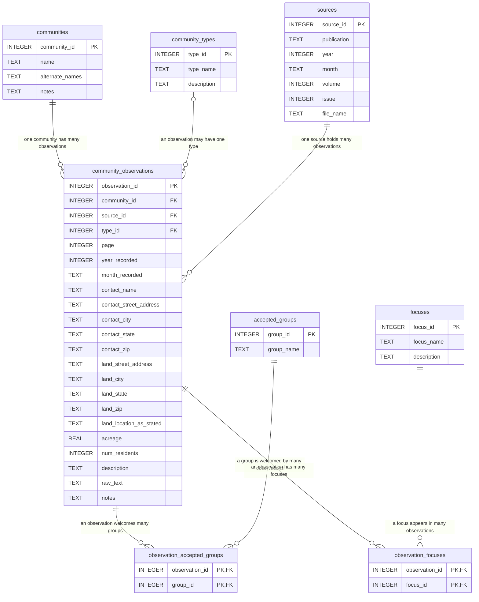

# Data model

This database records women's land communities as they appear in the land
directories of *Lesbian Connection*. Every row was checked cell by cell
against the scanned page. `schema.sql` holds the table definitions; this
document explains what each table means and the rules used to turn a printed
listing into rows.

## Diagram

## What one row is

| table | one row is |
|---|---|
| `sources` | one issue of a periodical |
| `communities` | one land community, however many times it was listed |
| `community_observations` | one listing of one community in one issue: a snapshot at that date |
| `community_types` | one category of land arrangement (lookup) |
| `accepted_groups` | one category of person a listing welcomes (lookup) |
| `observation_accepted_groups` | one group welcomed by one listing (junction) |
| `focuses` | one thing a community was built around: a population, a politics, or a purpose (lookup) |
| `observation_focuses` | one focus of one listing (junction) |

`communities` deliberately holds only what does not change between listings:
name, other names, and facts such as a founding date. Location, type, size,
residents and who is welcome are all recorded per observation, because they
can change over time. A community's first and last years are calculated with
`MIN`/`MAX(year_recorded)` rather than stored.

## Controlled vocabularies

**Community types** (`community_types`), judged *at the time of the listing*:

| id | type | definition |
|---|---|---|
| 1 | Land Trust | Land held collectively/legally by a trust rather than an individual owner |
| 2 | Intentional Community/Cooperative | A residential community organized around shared values, goals, ownership, labor, or decision-making |
| 3 | Private/Individual Land | Land owned and hosted by one person or family, sometimes open to visitors |
| 4 | Retreat/Gathering Space | Land used primarily for gatherings, retreats, or events |
| 5 | Land Fund/Seeking Land | A group organizing or fundraising to acquire land, not yet on it |

**Accepted groups** (`accepted_groups`): Lesbian women, Non-lesbian women,
Girl children, Boy children, Gay men, Non-gay men. The vocabulary names
non-lesbian women and non-gay men rather than "women" and "men", so that the
people these sources were written by and for are the unmarked default.

**Focuses** (`focuses`): what a community was built around, beyond who is
welcome. Added after The Beachtree (LC Dec 1982), a community of disabled
lesbians whose reason for existing the accepted-groups vocabulary could not
record.

| id | focus | definition |
|---|---|---|
| 1 | Disabled women | Centers disabled women or accessibility |
| 2 | Older women | Centers or especially seeks older women |
| 3 | Recovery/substance-free | Sobriety, 12-step, or drug/alcohol-free as a defining rule of the place |
| 4 | Working-class women | Explicitly centers working-class women |
| 5 | Lesbian separatism | Names separatism, or says only lesbians may live on the land |
| 6 | Spirituality/ritual | Spiritual practice, ritual, or celebration as part of its purpose |
| 7 | Farming/self-sufficiency | Food production, homesteading, or self-sufficiency as a stated goal |
| 8 | Workshops/education | Runs workshops, classes, or skill-sharing |
| 9 | Archives/cultural work | Houses archives, presses, arts, or cultural production |
| 10 | Environmentalism/eco-friendly | Chemical-free land, or another explicit environmental practice, as a rule or purpose of the place |
| 11 | Women of color/racial diversity | Centers women of color, or names racial diversity or third world women as a stated aim or policy |

New focuses are added only when a listing needs one.

## Encoding rules

### Scope: what counts as a listing
- Included: every listing in LC's land directories that describes land, plus
  two kinds of "Not a listing" row, which have no type and `notes` beginning
  "Not a listing":
  - mentions of a community's end: "A Woman's Place... [has] folded"; Ozark
    Wimmin's Land Trust, whose land "wound up in legal dissolution"
  - letters from a listed community that add to or correct its listing, such
    as Feathers Farm's 1983 letter
  Letters that name no community are not recorded.
- Excluded: groups without land, even when LC printed them. In Dec 1982 these
  were the groups under the editor's note "These groups don't have land, per
  se": The Pagoda Community, Ellie's Nest, River Most Wild, Aradia Inc Marie
  Curie Task Force, Women's Wilderness Experience, and Lesbians on Land (Joyce
  Cheney's call for stories). In Mar/Apr 1983: Gabriel's and Sea Gnomes Home.
- Included but flagged: land groups LC says are "not women's land groups, but
  they do welcome lesbians" (Oakynwomyn/Twin Oaks, Far Away Farm). Their
  `notes` begin "NOT WOMEN'S LAND" so queries can leave them out.

### Splitting listings
- One printed paragraph that names two separate groups becomes two
  observations (e.g. LAND TRUSTS FOR WOMEN, 1976, names Oregon and California
  Women's Land Trusts). Each gets the full shared paragraph as `raw_text`, and
  `notes` says it was listed jointly.

### `raw_text`
- The full listing, word for word. Never shortened.
- Transcribed from the page image, not the OCR: OCR errors are fixed to match
  the page, but the page's own spellings and typos are kept ("accomodate",
  "Demention", "no woman woman").
- A hyphen that only splits a word across a line break is joined
  ("Holly-wood" becomes "Hollywood"); hyphens that belong to the text are kept.
- Paragraphs within a listing are joined with a single space. Underlining is
  not marked.
- `[?]` marks a character that cannot be read on the page; `notes` explains it.
- Phone numbers and names stay in `raw_text` as printed.

### Addresses and location
- `contact_*` is the mailing address as printed, including misspellings
  ("Aeneaes Valley Road", "Port Angles"). Phone numbers and emails are not
  recorded as separate fields.
- Exception: a state code that is plainly a typo is corrected in the `*_state`
  fields, because a wrong code breaks queries by state (Lavender Hill: "Elk,
  AC 95432" stored as CA). `raw_text` keeps the printed form and `notes`
  records the correction.
- `land_*` is where the land is. It is filled only when the listing says so or
  the inference is strong, and every inference is explained in `notes`.
  Inferences used so far: mail addressed to a named farm or to the place itself
  ("Samson Road Farm", "A Woman's Place, Athol"); a street address for a group
  that "open[s] their house"; a rural route or RD box used for reservations. A
  PO box is never treated as the land.
- `land_location_as_stated` keeps the listing's own wording for vague places
  ("southern Oregon", "25 miles southeast of Tucson").

### `page`
- The printed page number where the listing begins. If it runs onto the next
  page, `notes` says "Continues on p. N."

### `communities`
- `name` is the name as printed. If a listing gives no name, the community is
  named from the listing's opening words ("Four Women") or from a place feature
  it names ("Elwha River land", when the opening words were only a greeting),
  and `communities.notes` explains where the name came from.
- Fields are filled only from sources in this database, and are updated as new
  issues are added.
- An organization and the land it owns or is buying are one community, even
  when LC prints them as separate listings. Each listing is its own
  observation of that community, and the land's name goes in
  `alternate_names`. Examples: Wisconsin Womyn's Land Co-op and DOE Farm;
  Oregon Women's Land Trust and Owl Farm (LC Mar/Apr 1983, two listings, both
  community 1).

### Type
- Every type is a judgment, and each observation's `notes` explains it.
- A group already living on its land is a community (usually type 2), even if
  the land is not paid off. An unpaid mortgage alone does not make it a land fund.
- A group not yet on land, still negotiating, or with no land mentioned is
  type 5.
- A place that calls itself a retreat is type 4, even if people live there; its
  residents are still counted in `num_residents`. If it calls itself both a
  community and a retreat, the type follows the one it names first (Lavender
  Hill, "a thriving womyn's community and retreat", is type 2).
- A place defined by what it offers visitors is type 4 by function, even
  without the word "retreat": a vacation ranch (North Crow) or an educational
  center (Who Farm Inc, Penthesileia, Inc).
- Land a listing says one woman bought and hosts is type 3. Type 3 also covers
  land that women live on and are in the process of acquiring privately
  (Feathers Farm: "we don't own Feathers Farm, at least not yet").
- A type is not revised when a later source corrects a detail. The later
  source becomes its own observation, and the earlier row's `notes` point to
  it.
- One or two women living on their land are type 3 (Feathers Farm, Adlai
  Neubauer & Karen Hamm, Misty Bottoms Farm), unless the listing recruits
  members to build a community, in which case it is type 2 (Susan B Anthony
  Memorial Unrest Home).
- None of the types fits a squat; the one squat so far (Ashfield Farm Women) is
  typed 2 with an explanation.

### `acreage`
- If the listing gives two different figures, the smaller one is stored and
  both are noted (Lavender Hill: "160 acres" in the text, "60 acres" on the
  form).
- Only land the listing presents as the group's own. Land they only have
  "access to", or that "surrounds" them, is left out and noted.
- For type 5 listings, the acreage they are trying to acquire is recorded and
  flagged in `notes` as not yet held.

### `num_residents`
- Members of the land community who live on the land. This includes members'
  children, and men when they are part of the collective (Elwha River land).
  Renters count when the listing places them within the lesbian land
  community (Okra Ridge Farm: "two members and two renters" = "4 lesbians").
  Tenants from outside it are not counted (Generous Earth Land, "rented to
  hets").
- **0** means the listing says no members live there (Generous Earth Land:
  "None of the dyke collective owners live there now"). **Blank** means the
  listing does not say.
- A questionnaire count ("We have/are: 4 lesbians") counts members. It is
  used only when the listing makes clear they live on the land; otherwise it
  goes in `notes`.
- If a range is given, the smaller number is stored and the range noted.
  Founders are not counted as current residents.
- A count taken from an earlier date (e.g. a visitor's account of the previous
  summer) is kept, and the date noted.

### Accepted groups
- In LC's 1982-and-later questionnaire directories, lesbians are never on the
  "We welcome:" list because the whole directory is for lesbians. So Lesbian
  women is coded for every listing that welcomes anyone. A listing that names
  no one (Susan Stone: "I welcome: letters", seeking "people") gets no rows.
- "Women" or "all women" means Lesbian women + Non-lesbian women.
- "Children", or children mentioned without a gender, means Girl children +
  Boy children.
- "Males" or "men" with no orientation given means Gay men + Non-gay men, with
  any conditions noted (Adlai Neubauer & Karen Hamm: "non oppressive males
  (not overnight)"). In the 1982 questionnaire directory, males are *not*
  coded unless the listing names them, because the editor says to "assume
  that dogs and males are NOT WELCOME" unless stated otherwise.
- Explicit restrictions are followed ("live only with dykes", "female children
  only").
- Every inferred group is noted. A listing that names no welcomed groups gets no
  junction rows.

### Focuses
- Coded only when the listing presents it as a purpose, identity, or rule of
  the place, not a passing mention or a checked questionnaire box ("We
  have/are: … farm land" alone is not a farming focus).
- Recorded per observation, so a community's focus can change over time.
- Environmentalism/eco-friendly covers explicit practices: chemical-free land,
  organic food-raising (Greenhope), solar or appropriate technology. A general
  ideal such as "living in harmony with nature" is not enough by itself.
- The table records what a place *is*, not what it opposes. A rejection (e.g.
  Feathers Farm finding separatism "unworkable and alienating") goes in
  `notes`.

### Wording
- `raw_text` keeps the listing's own terms. The fields we write ourselves
  (`description`, `notes`) use the controlled vocabulary's terms (e.g. "gay men").
